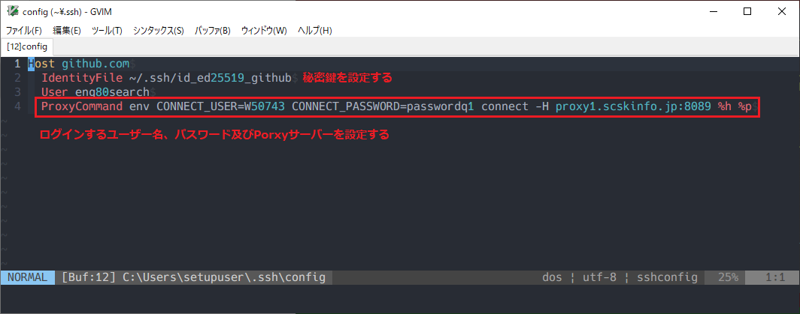
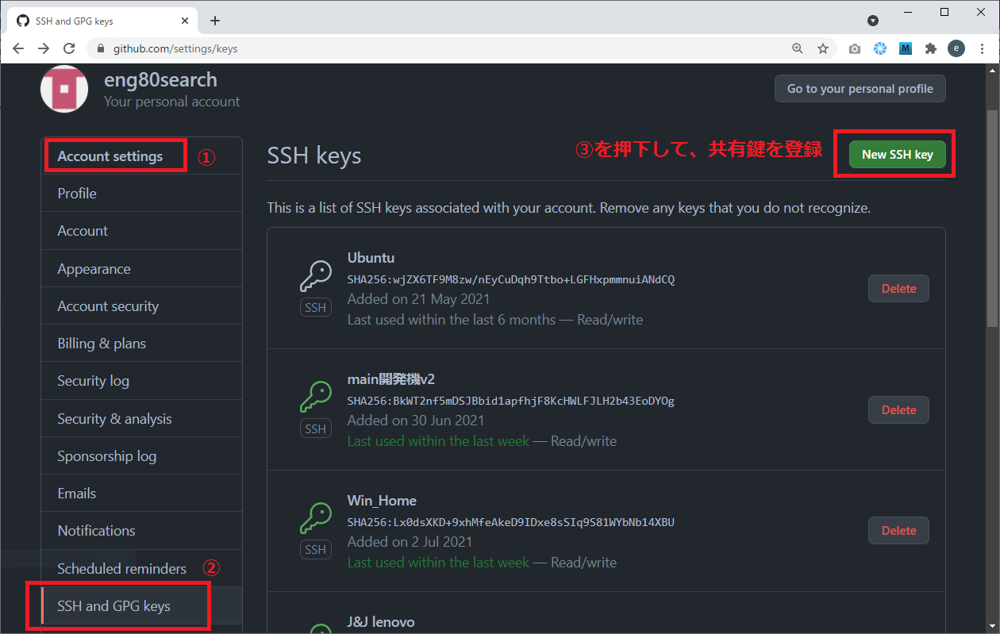
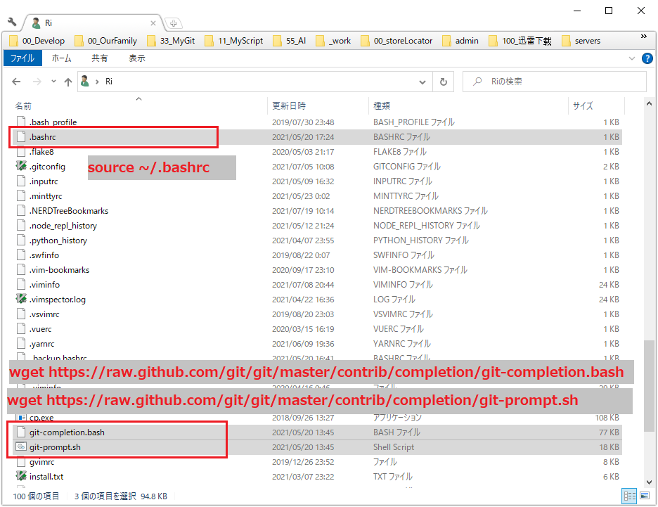

## Gitの設定ファイルについて

Git の設定ファイルには、

    system レベル (当該マシンの全ユーザに関する設定)
    global レベル (当該ユーザに関する設定)
    local レベル (特定のディレクトリ (リポジトリ) に関する設定)
の3種類があります。

#### system レベルの設定ファイル

    設定ファイルは次の場所にあります。

        {gitインストール先}\mingw64\etc\gitconfig
        %PROGRAMDATA%\Git\config (Git for Windows v2.x 以降)

    1つめの設定ファイルについては、
    git config -l --system で現在の設定内容が見れます。

    2つめの設定ファイルについては、
    git config -l --file={設定ファイルの場所} で現在の設定内容が見れます。

#### global レベルの設定ファイル(注意！ディレクトリではない）

    git config -l --global で現在の設定内容が見れます。
    設定ファイルは次の場所にあります。

    C:\Users\{username}\.gitconfig

#### local レベルの設定ファイル

    git config -l --local で現在の設定内容が見れます。
    設定ファイルは次の場所にあります。

    当該リポジトリ直下の .git\config

## Gitのssh接続方法

1. git bashターミナルでsshキーを作成する

1. (Proxyありの場合) ~/.ssh/configファイルを作成し、以下のように設定する
        Host github.com
          IdentityFile ~/.ssh/id_ed25519_github
          User eng80search
          ProxyCommand env CONNECT_USER=W50743 CONNECT_PASSWORD=passwordq1 connect -H proxy1.scskinfo.jp:8089 %h %p

1. 生成されたsshキーのうち、publicキーをGithubに登録する

1. gitのremote接続をssh接続に設定する(新規の場合はgit remote add origin )

## Git Bashプロンプトにstatusを表示する設定
[参考リンク](https://tm.root-n.com/unix:command:git:bash_prompt)

1. まず「git-completion.bash」と「git-prompt.sh」ダウンロード

        $wget https://raw.github.com/git/git/master/contrib/completion/git-completion.bash
        $wget https://raw.github.com/git/git/master/contrib/completion/git-prompt.sh

1. bashrc に下記を追記

        export LANG=ja_JP.UTF-8

        GIT_PS1_SHOWDIRTYSTATE=true
        GIT_PS1_SHOWUNTRACKEDFILES=true
        GIT_PS1_SHOWSTASHSTATE=true
        GIT_PS1_SHOWUPSTREAM=auto
            

1. sourceコマンドで設定を反映

        source ~/.bashrc

1. ファイル構成

