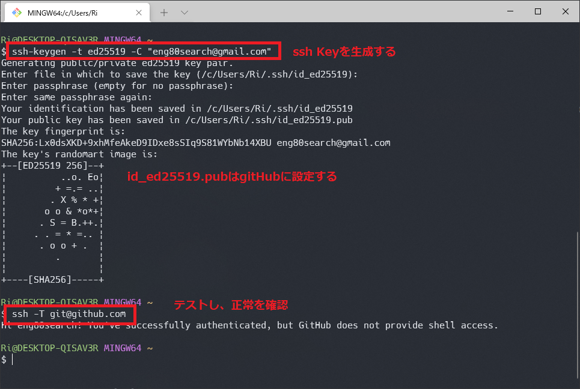
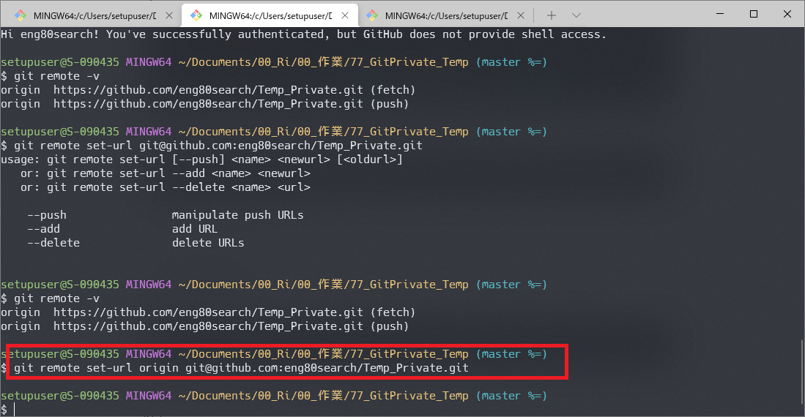

## Gitの設定ファイルについて

Git の設定ファイルには、

    system レベル (当該マシンの全ユーザに関する設定)
    global レベル (当該ユーザに関する設定)
    local レベル (特定のディレクトリ (リポジトリ) に関する設定)
の3種類があります。

#### system レベルの設定ファイル

    設定ファイルは次の場所にあります。

        {gitインストール先}\mingw64\etc\gitconfig
        %PROGRAMDATA%\Git\config (Git for Windows v2.x 以降)

    1つめの設定ファイルについては、
    git config -l --system で現在の設定内容が見れます。

    2つめの設定ファイルについては、
    git config -l --file={設定ファイルの場所} で現在の設定内容が見れます。

#### global レベルの設定ファイル(注意！ディレクトリではない）

    git config -l --global で現在の設定内容が見れます。
    設定ファイルは次の場所にあります。

    C:\Users\{username}\.gitconfig

#### local レベルの設定ファイル

    git config -l --local で現在の設定内容が見れます。
    設定ファイルは次の場所にあります。

    当該リポジトリ直下の .git\config

## Gitのssh接続方法

1. git bashターミナルでsshキーを作成する

2. 生成されたsshキーのうち、publicキーをGithubに登録する
1. gitのremote接続をssh接続に設定する

